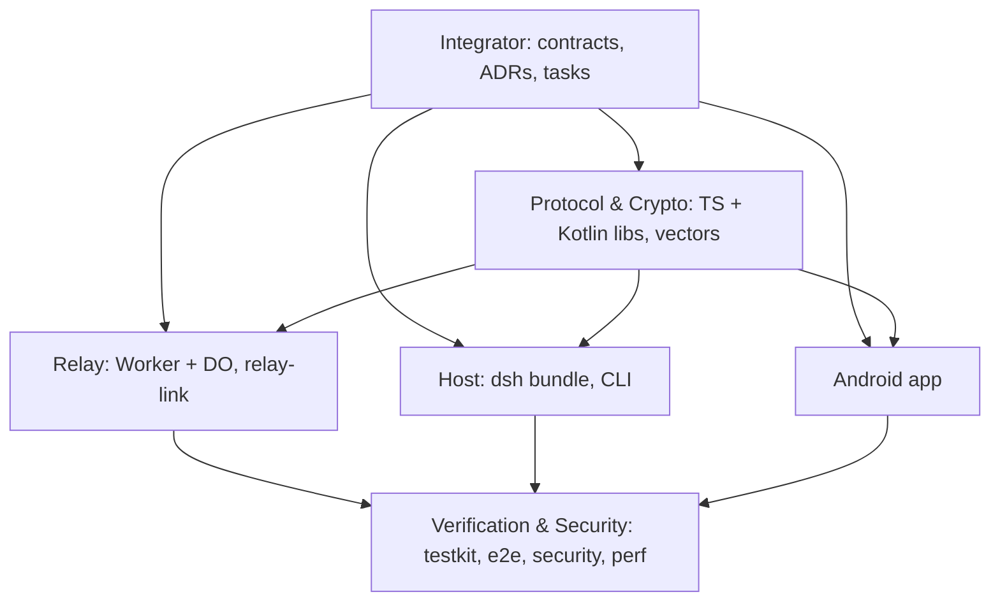

# AGENTS.md — Remora operating manual

> Remora = remote control for the DeepSeek Harness (`dsh`) from an Android phone, through a self-hosted, end-to-end encrypted relay.
> This file is the contract for every agent and human working here: Claude Code (via `CLAUDE.md`), Codex, Gemini / Antigravity (via `GEMINI.md`), the DeepSeek Harness itself, and people. Follow it strictly; when it conflicts with a task packet, this file wins and you stop and report.

## 0. Start here

1. Read this file completely.
2. Read [docs/blueprint.md](docs/blueprint.md) §1–§7 (architecture, trust model, protocol stack).
3. Read your task packet in [docs/tasks/](docs/tasks/README.md) and every input it lists.
4. Touching the host plugin? Read [docs/upstream/dsh-integration.md](docs/upstream/dsh-integration.md) and fetch the upstream source (`node scripts/fetch-upstream.mjs`).
5. Touching a wire format or crypto? Read the spec: [RCP/1](docs/specs/rcp-v1.md), [RLY/1](docs/specs/relay-v1.md), [Crypto/1](docs/specs/crypto-v1.md).

Project status: **P0 — Specify & Spike.** The code tree is a building skeleton; the specs are `v1-draft` until task P0-A2 freezes them.

## 1. Cardinal invariants (non-negotiable)

1. **End-to-end or nothing.** RCP content exists in plaintext only inside the host process and the phone app. The relay and FCM carry ciphertext. Never add a feature that needs the relay to read, store, or log content. Never add a plaintext or "debug" transport, even behind a flag.
2. **Outbound only.** The host opens no listening socket. Its only network connections are outbound `wss://` to the relay (plus dsh's own loopback GUI, which Remora extends only through dsh's authenticated `/api` routes).
3. **Pinned identities.** The phone pins the host key from the QR; the host admits only paired, non-revoked device keys with the right PSK; pairing requires the one-time ticket, the pairing secret, and SAS confirmation on the PC.
4. **Fail closed.** Any validation, crypto, policy, or state error denies the request. No fallback to weaker behavior, no silent defaults for missing security config.
5. **Host enforces, UI assists.** Roots containment, risk classification, biometric-signature checks, and rate limits are enforced by the host's Policy Guard. The app's checks are conveniences, never the control.
6. **dsh is untouched.** No patches to `@deepseek-ai/*` packages, no edits to the owner's dsh installation or to profiles other than `remora*`. Integrate only through documented seams, only from `packages/host/src/adapter/**` (and `src/interaction/dsh-*.ts`). Record every seam in `docs/upstream/dsh-integration.md`.
7. **Exactly-once effects.** Every mutating RCP request carries a `requestId`; retries must not execute twice. Approval and question answers are single-use.
8. **No secrets or content in logs, errors, analytics, crash reports, or test snapshots.** Use the redaction helpers; log ids truncated to 6 characters.
9. **Bounded everything.** RCP message ≤ 48 KiB, relay frame ≤ 64 KiB, per-device rate limits, stream caps, paged reads, coalesced live output.
10. **Contracts are shared.** A wire or crypto change lands in one PR together with the spec, the TypeScript implementation, the Kotlin implementation, and the conformance vectors (see §6).

## 2. Repository map

```text
AGENTS.md  CLAUDE.md  GEMINI.md  README.md       agent/human entry points
docs/
  blueprint.md                                   architecture (start here)
  roadmap.md                                     phases, dependency graph
  specs/{rcp-v1,relay-v1,crypto-v1,threat-model}.md   normative contracts
  adr/                                           decisions (never rewritten)
  tasks/                                         task packets = source of truth for issues
  upstream/dsh-integration.md                    verified dsh facts + open questions
  spikes/                                        P0 findings (created by spikes)
  runbooks/                                      operations, device testing
  agent-handoffs/                                one report per completed task
conformance/vectors/                             cross-language test vectors (TS + Kotlin)
packages/                                        pnpm workspace (TypeScript, ESM)
  protocol/     @remora/protocol     RCP/1 + RLY/1 types, zod schemas, codecs
  crypto/       @remora/crypto       Noise IKpsk2, ids, relay auth, pairing, signatures, push AEAD
  relay-link/   @remora/relay-link   relay client for Node
  host/         @remora/host         dsh bundle + Cordis plugin (the PC side)
  testkit/      @remora/testkit      fake phone, adversarial relay, e2e environment
apps/
  relay/        @remora/relay        Cloudflare Worker + Durable Object AccountHub
  cli/          @remora/cli          `remora` command: service, supervisor, doctor
  android/                           Gradle project: Remora for Android
scripts/                                         fetch-upstream, sync-issues
spikes/                                          throwaway P0 prototypes (not built by the workspace)
.github/                                         CI workflows, issue & PR templates
```

## 3. Roles and ownership

Each task packet names one role and its `owned_paths`. Modify only those paths (plus your handoff report). Cross-cutting needs go through the Integrator.

| Role | Key | Owns | Authority |
|---|---|---|---|
| Integrator / Architect | `integrator` | `docs/blueprint.md`, `docs/specs/**`, `docs/adr/**`, `docs/roadmap.md`, `docs/tasks/**`, root configs (`package.json`, `pnpm-workspace.yaml`, `tsconfig.base.json`, `.github/**`), `conformance/README.md` + schema | Only role that changes contracts, versions, root tooling, and task packets; merges cross-role PRs |
| Protocol & Crypto | `protocol-crypto` | `packages/protocol`, `packages/crypto`, `conformance/vectors/**`, `apps/android/core/{protocol,crypto,model}` | Owns cross-language parity; must implement both languages for any change |
| Relay | `relay` | `apps/relay`, `packages/relay-link` | Owns Cloudflare config and quotas |
| Host (dsh integration) | `host` | `packages/host`, `apps/cli` | Only role that imports `@deepseek-ai/*`; owns `docs/upstream/dsh-integration.md` updates |
| Android | `android` | `apps/android/**` except the Protocol & Crypto modules | Owns UX, Keystore/biometrics, notifications |
| Verification & Security | `verification` | `packages/testkit`, `tests/**`, security/perf reports, CI job definitions for tests | **Veto:** can block any phase exit whose gates fail |



## 4. Commands

Prerequisites: Node ≥ 24 (see `.node-version`), pnpm (version pinned in `package.json#packageManager`; `corepack enable` or a global pnpm), JDK 21, Android SDK (platform 34 for the skeleton), Git. Windows is the primary development OS; use PowerShell or Git Bash.

```sh
pnpm install                         # all TypeScript workspaces
pnpm run build                       # tsc -b for packages that emit (host, protocol, crypto, relay-link, testkit, cli)
pnpm run typecheck                   # every workspace, no emit
pnpm run lint                        # oxlint
pnpm test                            # unit tests (Vitest) incl. relay tests in workerd
pnpm run conformance:check           # validate vector files against the schema
pnpm test:e2e                        # e2e (available from P1-T1)
pnpm test:security                   # security suite (available from P3-T1)

pnpm -F @remora/relay run dev        # local relay on http://127.0.0.1:8787 (wrangler dev)

cd apps/android
./gradlew assembleDebug              # build the app (gradlew.bat on Windows cmd)
./gradlew testDebugUnitTest          # JVM unit tests, incl. conformance vectors

node scripts/fetch-upstream.mjs      # sparse upstream dsh checkout into .upstream/ at the pinned tag
node scripts/sync-issues.mjs --dry-run   # preview GitHub milestones/issues from docs/tasks
```

Running the host inside dsh during development (never in the owner's `web` profile):

```sh
pnpm -F @remora/host run build
dsh --profile remora-dev --from-default-profile web      # once
dsh plugin --profile remora-dev add ./packages/host      # from the repo root
dsh --profile remora-dev --no-open --port 7718
```

## 5. Working a task

1. **Pick** a *Ready* packet (all `depends_on` merged). Claim its GitHub issue.
2. **Branch** `task/<id>-<slug>` from `main`.
3. **Plan** in the PR description before large changes (L-size tasks): approach, files, risks.
4. **Implement** inside `owned_paths`. Keep diffs focused; no drive-by refactors.
5. **Test** with the packet's *Verify* commands plus the gates in §8 for every area you touched.
6. **Report** in `docs/agent-handoffs/<id>.md` (template in that folder): what changed, commands run with results, deviations, known limits, what it unblocks.
7. **PR** titled `<id>: <summary>`, body from the PR template, `Closes #<issue>`.

**Definition of Done:** acceptance boxes checked with evidence · gates green · docs updated (README of touched package, spec if behavior visible on the wire, `dsh-integration.md` if a dsh seam was used or re-verified) · handoff report committed · no TODO without an issue link.

**Stop and report** (comment on the issue, tag the Integrator, stop coding) when:

- you need to change anything outside `owned_paths`, a frozen spec, a conformance vector's meaning, or an ADR;
- an invariant in §1 would be weakened, even temporarily;
- upstream dsh behaves differently from `docs/upstream/dsh-integration.md`;
- you need an owner action: Cloudflare login/deploy, Firebase project, secrets, signing keys, SDK license acceptance, physical phone steps, anything that costs money or publishes something;
- a test is flaky and you are tempted to skip it.

## 6. Contract change process

Contracts = `docs/specs/**`, `packages/protocol` public types, `packages/crypto` public API, `conformance/vectors/**`, the RCP/RLY/Crypto version numbers, and the Kotlin twins.

1. Open an issue labeled `contract-change` describing the problem, the proposed wire/API change, compatibility impact, and affected tasks.
2. The Integrator accepts, rejects, or amends it (an ADR if it changes a decision).
3. One PR implements it everywhere: spec text + changelog, TypeScript, Kotlin, vectors, affected packets. The Protocol & Crypto role reviews; Verification confirms vectors.
4. Additive changes keep the version; breaking changes bump the protocol version and keep the old one for one release.

## 7. Engineering conventions

### 7.1 General

- Small PRs, one concern each. Conventional Commits with the task id as scope: `feat(P2-H2): map tool.result events`, `fix(P1-R1): close 4409 on replacement`, `test(P3-T1): add junction escape case`, `docs(P0-A2): freeze RCP v1`.
- Names say what things are; no abbreviations beyond the glossary (RCP, RLY, SC, SAS, PSK).
- Comments state contracts and non-obvious reasons, not narration. Public functions have JSDoc/KDoc.
- No dead code, commented-out code, or unused dependencies. New dependencies need a line in the PR explaining why an existing one is insufficient.

### 7.2 TypeScript

- ESM only (`"type": "module"`), `strict`, `noUncheckedIndexedAccess`, `exactOptionalPropertyTypes`. No `any` (use `unknown` + narrowing); no non-null assertions without a comment.
- Validate every untrusted input with zod at the boundary (RCP from phones, relay frames, config, files). Trust TypeScript for same-process typed calls.
- Discriminated unions + `assertNever` for closed unions; explicit fallbacks for open ones.
- Errors: typed error classes with stable codes; never throw strings; map to RCP errors at the RCP boundary only.
- Tests: Vitest, colocated as `src/**/*.test.ts` or in `test/`; deterministic (inject clocks and randomness).
- Packages that run in workerd (`protocol`, `crypto`, `relay`) must not import `node:*` or use `Buffer`.

### 7.3 Inside the dsh process (`packages/host`)

- Plugin shape: `export const name`, `export const inject`, `export const Config` (schemastery), `export function apply(ctx, config)`; explicit `resolve(config)` for defaults; misconfiguration throws at load with an actionable message.
- `@deepseek-ai/cordis` and `@deepseek-ai/schemastery` are **peer** dependencies. Every other `@deepseek-ai/*` import is `import type` and lives in `src/adapter/**` or `src/interaction/dsh-*.ts` only.
- Every listener, timer, socket, route is a Cordis effect with a disposer (`ctx.effect`, `ctx.on`). Disposal must finish within 2 s (dsh gives the tree 5 s).
- Waterfall listeners either return a result or call `next()` exactly once.
- Never block the event loop: no sync crypto on large inputs, no sync filesystem in request paths, no busy waits.
- Use `ctx.logger`; never `console.*` in `packages/host/src`.
- Tests run against fixtures and fakes; tests that need a real dsh live in `tests/e2e` and use an isolated temporary `DSH_HOME`.

### 7.4 Relay (`apps/relay`)

- Workers runtime only; state that must survive hibernation lives in SQLite or socket attachments (≤ 16 KiB), never in instance fields alone.
- The relay reads only the 28-byte data-frame header. Any new field the relay needs goes into RLY/1 first (§6).
- Schema changes are forward-only migrations applied at object start.
- Count billed operations; keep writes throttled; never loop over all sockets on hot paths when a tag lookup works.

### 7.5 Android (`apps/android`)

- Module rules from blueprint §10.2; features never touch OkHttp, Room, Keystore, or Firebase APIs directly.
- Coroutines with structured concurrency (no `GlobalScope`); ViewModels expose immutable `StateFlow` UI state; Compose screens are stateless with hoisted state; Hilt for DI.
- All user-facing strings in resources; content descriptions for icons; 48 dp touch targets; support font scale 200 %.
- Security: keys only via `:core:security`; `FLAG_SECURE` on sensitive screens; no logging of message content; release builds reject cleartext.

### 7.6 Security coding rules

- Constant-time comparison for MACs, tokens, secrets. Zeroize key material you own after use.
- Never disable TLS verification, never trust a peer id that did not come from the relay header *and* the Noise handshake.
- Randomness only from `crypto.getRandomValues` / `SecureRandom`.
- New code that handles secrets, crypto, paths, or approvals needs a reviewer from Verification & Security.

### 7.7 Documentation

- Docs change with code: package README, spec (if wire-visible), `dsh-integration.md` (if a dsh seam), runbooks (if an operator step changes).
- Decisions go into a new ADR; don't edit accepted ADRs except their status line.

## 8. Quality gates

| Area touched | Must pass |
|---|---|
| any TypeScript | `pnpm run typecheck`, `pnpm run lint`, `pnpm test` |
| `packages/protocol`, `packages/crypto`, `conformance/**` | the above + `pnpm run conformance:check` + Android `:core:protocol:test :core:crypto:test` |
| `apps/relay` | `pnpm -F @remora/relay test`, `wrangler deploy --dry-run` |
| `packages/host` | unit tests + `pnpm test:e2e` for affected scenarios (from P1-T1) |
| `apps/android` | `./gradlew assembleDebug testDebugUnitTest` |
| security-sensitive (crypto, policy, interaction, relay routing) | `pnpm test:security` (from P3-T1) + Verification review |

Coverage floors (enforced from P1): ≥ 95 % lines for `protocol` and `crypto`; ≥ 90 % for `host/src/{policy,interaction,channel,rcp}` and `apps/relay/src`. Never skip, delete, or loosen a test to get green; fix the code or stop and report.

## 9. Git and pull requests

- `main` is always releasable; no direct pushes; squash-merge PRs.
- Never rewrite published history; `--force-with-lease` only on your own task branch.
- PR template sections: Summary, Task, Changes, Verification (commands + results), Risks, Screenshots (UI), Checklist.
- Commits and PRs made by agents end with the attribution lines their harness requires.

## 10. Secrets and local files

| Secret | Lives in | Never in |
|---|---|---|
| `REMORA_ENROLL_SECRET` | Cloudflare secret + dsh credentials key `REMORA_RELAY_ENROLL_SECRET` | git, config files, logs |
| `FCM_SERVICE_ACCOUNT_JSON` | Cloudflare secret | git, host, app |
| `apps/android/app/google-services.json` | owner's disk (git-ignored) | git |
| Android release keystore + passwords | owner's disk / env vars | git, CI logs |
| Host/device keys, PSKs, push keys | dsh credentials / Tink / Keystore | anywhere else |

Tests use fixed, obviously fake keys generated for vectors (`conformance/vectors/**` contain test keys only). `.env*`, `.dev.vars`, `.upstream/`, `.scratch/` are git-ignored; put scratch files in `.scratch/`.

## 11. Working with upstream dsh

- Pinned baseline: `upstream.lock.json` (npm version + git tag). Read upstream code from `.upstream/deepseek-harness` (via `scripts/fetch-upstream.mjs`), never from memory.
- Never modify `~/.dsh` profiles other than `remora-dev` (development) and `remora` (owner's always-on host, only via documented steps with owner approval). Tests use a temporary `DSH_HOME`.
- dsh version bump: re-run P0-S1-style fixture recording, adapter tests, and e2e against the new version; update `upstream.lock.json` and the verification log in `docs/upstream/dsh-integration.md`.
- Missing seam in dsh: document a proposal (GitHub Discussions text) in `dsh-integration.md` §8; do not patch dsh.

## 12. Notes per agent

- **Claude Code:** `CLAUDE.md` imports this file. Use plan mode for L-size packets; keep the handoff report current as you go.
- **Codex:** reads this file natively; run the Verify commands before finishing.
- **Gemini CLI / Antigravity:** `GEMINI.md` imports this file.
- **DeepSeek Harness (`dsh`) as a developer:** fine to use for tasks here, but run it from a profile other than `remora-dev`/`remora-e2e` so the plugin under development never governs the agent building it.
- Ask the owner (repository admin on GitHub: `lottooss`) for any action listed under *Stop and report → owner action*.

Glossary: [blueprint Appendix A](docs/blueprint.md#appendix-a--glossary).
