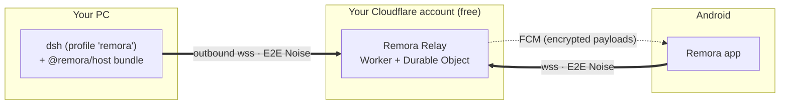

# Remora

**Remote control for the DeepSeek Harness from your Android phone — anywhere, end-to-end encrypted.**

Remora attaches to the `dsh` agent running on your PC the way a remora rides with a whale: the harness keeps doing the work on your machine; your phone becomes a remote window onto it. See every session, watch answers stream in, send prompts, approve tool calls (with a fingerprint for risky ones), answer the agent's questions, start new sessions in allowed folders, browse files and diffs, and get notified when the agent needs you.

> **Status: P0 — Specify & Spike.** Architecture, contracts, and task plan are written; the code tree is a building skeleton. Nothing is usable yet.



## Documents

| For | Read |
|---|---|
| Everyone | [Architectural blueprint](docs/blueprint.md) |
| Agents and contributors | [AGENTS.md](AGENTS.md) (operating manual), [roadmap](docs/roadmap.md), [task packets](docs/tasks/README.md) |
| Protocol and security | [RCP/1](docs/specs/rcp-v1.md) · [RLY/1](docs/specs/relay-v1.md) · [Crypto/1](docs/specs/crypto-v1.md) · [Threat model](docs/specs/threat-model.md) |
| Why things are the way they are | [ADRs](docs/adr/README.md) |
| dsh internals Remora relies on | [dsh integration notes](docs/upstream/dsh-integration.md) |
| Running it (owner) | [Operations runbook](docs/runbooks/operations.md) |

## Repository layout

```text
packages/   @remora/protocol · crypto · relay-link · host (dsh bundle) · testkit     (pnpm, TypeScript)
apps/       relay (Cloudflare Worker) · cli (`remora` command) · android (Gradle, Kotlin)
docs/       blueprint, specs, ADRs, roadmap, task packets, runbooks
conformance/  cross-language test vectors
```

## Development quick start

```sh
pnpm install
pnpm run build && pnpm run typecheck && pnpm test
cd apps/android && ./gradlew assembleDebug
```

Requirements: Node ≥ 24, pnpm, JDK 21, Android SDK platform 34, Git. Details in [AGENTS.md §4](AGENTS.md#4-commands).

## Baseline

DeepSeek Harness `@deepseek-ai/dsh@0.1.5-rc.3` (see [`upstream.lock.json`](upstream.lock.json)). Remora is an independent project and is not affiliated with DeepSeek.
