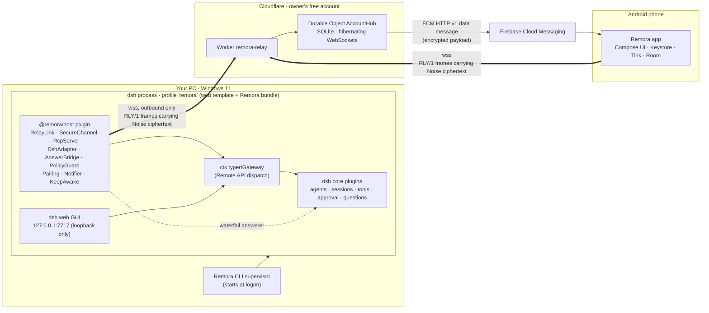
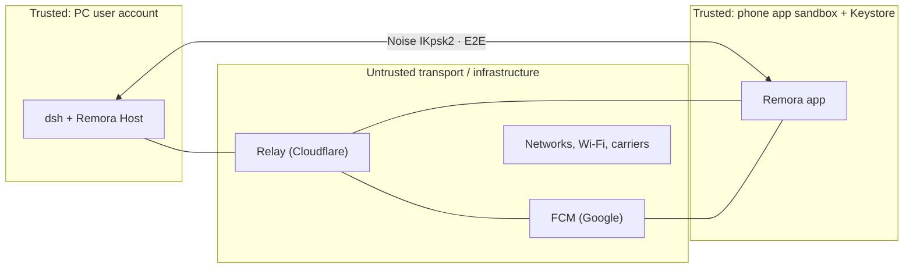
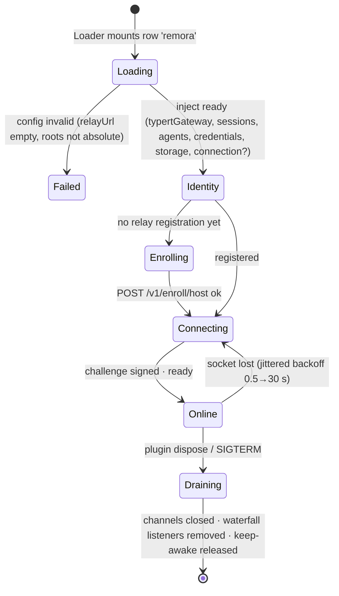
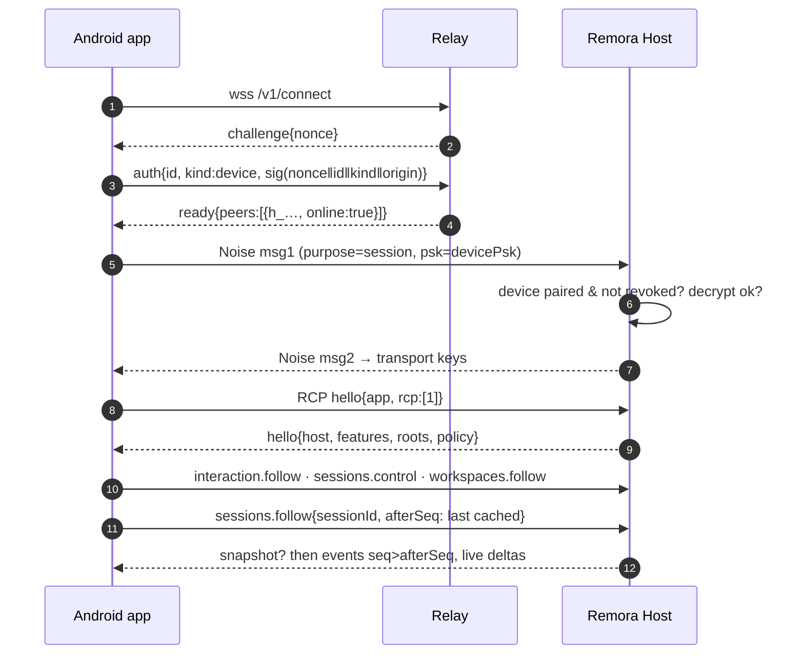
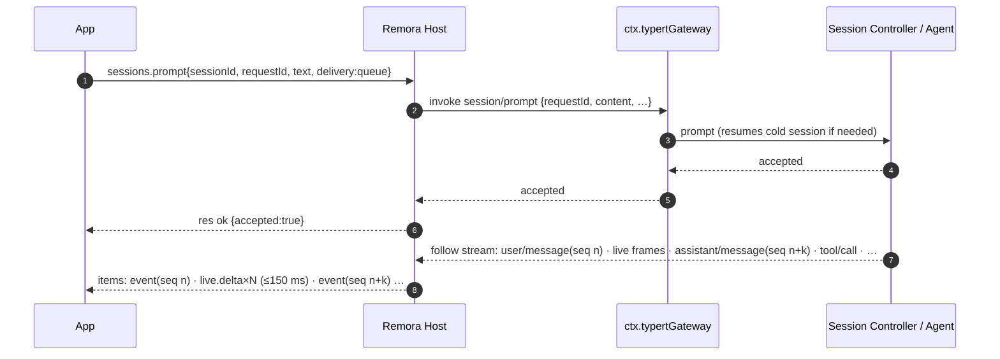

# Remora — Architectural Blueprint

> Remote control for the DeepSeek Harness (`dsh`) from an Android phone, anywhere, end-to-end encrypted.
> Remora is the fish that rides along with a whale: it attaches to the harness running on your PC and never replaces it.

| | |
|---|---|
| Status | **v1 blueprint — approved for P0 (Specify & Spike)** |
| Date | 2026-09-24 |
| Owner | Integrator / Architect role (see [AGENTS.md](../AGENTS.md#3-roles-and-ownership)) |
| dsh baseline | `@deepseek-ai/dsh@0.1.5-rc.3` (npm `latest`, git tag `dsh-v0.1.5-rc.3`); canary: npm `next` |
| Normative specs | [RCP/1](specs/rcp-v1.md) · [RLY/1](specs/relay-v1.md) · [Crypto/1](specs/crypto-v1.md) · [Threat model](specs/threat-model.md) |
| Decisions | [ADR index](adr/README.md) |
| Plan | [Roadmap](roadmap.md) · [Task packets](tasks/README.md) |
| Upstream facts | [dsh integration notes](upstream/dsh-integration.md) |

Keywords **MUST**, **MUST NOT**, **SHOULD**, **MAY** follow RFC 2119. Assumptions marked during early design are documented as resolved notes linking to their findings in `docs/spikes/`.

---

## 1. Summary

Remora lets you leave your PC, take out your phone, and keep driving the dsh agent that runs on that PC: see every session, read the streamed answer as it arrives, send prompts, approve or reject tool calls, answer the agent's questions, stop runaway turns, start new sessions in allowed folders, browse files and diffs, and get push notifications when the agent needs you. All execution stays on the PC. The phone is a remote window; the relay is a blind pipe.

Four pieces:

1. **Remora Host** — an out-of-tree dsh *bundle* (`@remora/host`) installed into a dsh profile with `dsh plugin`. It dials **out** to the relay, terminates end-to-end encryption, and translates a small, stable, phone-oriented protocol (**RCP/1**) into dsh's internal Remote API and Cordis events.
2. **Remora Relay** — a Cloudflare Worker plus one Durable Object (`AccountHub`) on the owner's free Cloudflare account. It authenticates endpoints, routes opaque encrypted frames between the PC and paired phones, tracks presence, and sends FCM pushes whose payloads it cannot read.
3. **Remora for Android** — a native Kotlin/Jetpack Compose app. It pairs by QR code, holds its keys in the Android Keystore and Tink, and signs high-risk approvals with a biometric-bound key.
4. **Remora CLI** — `remora service install|uninstall|status|logs` keeps the host running at logon, supervised, and keeps the PC awake while agents work.

### Key decisions

| # | Decision | ADR |
|---|---|---|
| D1 | Extend dsh with an out-of-tree bundle; never fork or patch upstream | [0001](adr/0001-out-of-tree-dsh-bundle.md) |
| D2 | Self-hosted E2E relay on Cloudflare Workers + one SQLite-backed Durable Object with WebSocket hibernation | [0002](adr/0002-cloudflare-e2e-relay.md) |
| D3 | Phone speaks RCP/1, an anti-corruption layer; the host adapter reaches dsh through `ctx.typertGateway` and Cordis events | [0003](adr/0003-rcp-anti-corruption-layer.md) |
| D4 | `Noise_IKpsk2_25519_ChaChaPoly_SHA256` secure channel, pairing by QR + SAS confirmation on the PC | [0004](adr/0004-noise-ikpsk2-secure-channel.md) |
| D5 | Native Android app: Kotlin, Compose, Hilt, multi-module | [0005](adr/0005-native-android-client.md) |
| D6 | FCM data messages sent by the relay, payloads end-to-end encrypted with a per-device push key | [0006](adr/0006-fcm-push-via-relay.md) |
| D7 | Capability parity with the PC GUI, gated by biometric-bound signatures for high-risk approvals and a folder allowlist | [0007](adr/0007-biometric-gated-parity.md) |
| D8 | Host-side answer bridge races phone and PC GUI for approvals and questions; first valid answer wins | [0008](adr/0008-answer-bridge-race.md) |
| D9 | Always-on host = supervisor started at logon + keep-awake while agents run | [0009](adr/0009-always-on-host.md) |
| D10 | One monorepo: pnpm TypeScript workspace + Gradle Android project + shared conformance vectors | [0010](adr/0010-monorepo-toolchain.md) |

---

## 2. Goals, non-goals, success criteria

### 2.1 Goals (v1)

- **G1 Continue work remotely.** From the phone: list sessions across all workspaces, open one, see full history and live streaming output, send prompts (queue or steer), cancel a turn, change model.
- **G2 Human-in-the-loop remotely.** Approve/reject tool calls and answer `ask_user_question` prompts from the phone, including plan reviews, with the PC GUI still usable at the same time.
- **G3 Start work remotely.** Start a new session in a registered workspace or in a folder inside an allowlisted root.
- **G4 Inspect work remotely.** Browse workspace files read-only, view files, view git status/diffs and files touched by the agent.
- **G5 Be told.** Push notifications for approval needed, question asked, turn finished, turn failed, PC went offline.
- **G6 Always available.** The host runs at logon without a terminal and keeps the PC awake while agents are busy.
- **G7 Secure by construction.** The relay cannot read or forge content; a lost phone can be revoked; risky actions need a fresh biometric.
- **G8 Zero upstream friction.** Works with an unmodified dsh installation; survives dsh upgrades through a single adapter layer.

### 2.2 Non-goals (v1)

- iOS or web clients (the protocol does not preclude them later).
- Multi-user / team sharing. One owner, N PCs, M phones.
- Remote terminal/PTY access, arbitrary shell from the phone outside the agent, file editing from the phone.
- Waking a sleeping or powered-off PC (no Wake-on-LAN).
- Controlling the dsh Electron desktop app's reserved `desktop` profile (the CLI refuses plugin management for it).
- Publishing to Google Play or npm.

### 2.3 Success criteria (measured in P6)

| Metric | Target |
|---|---|
| Prompt tap → host acknowledgement | p50 ≤ 400 ms, p95 ≤ 1.2 s on LTE |
| Host receives assistant chunk → visible on phone | p50 ≤ 350 ms (includes ≤150 ms coalescing) |
| Network change → streams resumed with no gaps | p50 ≤ 3 s; zero lost or duplicated durable events |
| Approval request → push notification shown | p50 ≤ 3 s |
| Relay usage for one heavy personal day (8 h active streaming) | ≤ 20 % of the Cloudflare free-tier daily request quota |
| Idle phone battery cost | no persistent socket while backgrounded; push only |
| Security | all [threat-model](specs/threat-model.md) mitigations tested; no plaintext at the relay; no secret in logs |

---

## 3. Context: facts about dsh that shape this design

All facts below were verified against `deepseek-ai/deepseek-harness` at tag `dsh-v0.1.5-rc.3`; file references and details live in [upstream/dsh-integration.md](upstream/dsh-integration.md).

1. **Everything is a Cordis plugin.** A running `dsh` is a plugin tree composed from ordered patch layers: bundles listed in the profile manifest, then the profile's `cordis.patch.yml`, then `$DSH_HOME/cordis.patch.yml`, then `--patch` overlays.
2. **Out-of-tree bundles are first-class.** A package whose `package.json` declares `"dsh": { "bundle": { "patch": "./cordis.patch.yml" } }` joins the layer stack when installed with `dsh plugin --profile <name> add <spec>`; local paths (`add ./packages/host`) work without build allowances. Bundle membership changes need a profile restart; patch edits hot-reload in live profiles.
3. **The web profile is loopback-only by design.** `dsh web` rejects `--host 0.0.0.0`; every `/api` call needs a browser session cookie minted from a one-time launch token; a Host/Origin trust fence blocks DNS rebinding and cross-site requests. Remora never weakens this: it adds no listener.
4. **A typed Remote API is the UI boundary.** Web clients call Host services through Typert descriptors: unary `POST /api/<namespace>/<method>` and multiplexed streams over `/api/remote.mux`. In-process, the same dispatch is available as `ctx.typertGateway.invoke({ namespace, method, args, signal })` and `ctx.typertGateway.stream(...)`, with identical validation and the Session Controller's cold-resume lookup policy. The Electron shell already drives this API without any web server, which proves the dispatch is carrier-neutral.
5. **Session Controller already solves remote session work.** Endpoints `session/{list,search,create,selectModel,modelCatalog,rename,fork,prompt,attachment,updateQueue,cancel,page}` plus streams `session/follow` (opening snapshot, gap-free durable events, optional cursorless live assistant frames, resume from a sequence cursor) and `session/control` (live queue/jobs/projection baseline + replacements). Prompts carry a `requestId`; retries of a queued or logged `requestId` return the original acceptance (idempotency for free).
6. **Workspaces and files are exposed.** `workspace/*` (create, rename, archive, `follow` stream), `directoryPicker/{list,createDirectory,pick}`, and `workspaceFiles/{stat,read,readBytes,readAll,readRelated,list,changes}`. File reads are **not** confined to the workspace; directory listing starts at the home directory. Remora MUST add its own containment.
7. **Approvals and questions are waterfalls.** `approval/request` (outcomes `allowed-once | rejected | cancelled | unavailable`) and `user-questions/request` are Agent-scoped Cordis waterfalls. The web app forwards them per connected browser client *in listener order*; with no client connected the chain falls through to `unavailable` (approvals fail closed) or `NO_PROVIDER` (questions error). A deployment composes exactly one terminal answerer. This is why Remora needs its own answerer (D8).
8. **Conventions Remora inherits** because its code runs inside the dsh process: ESM only; `@deepseek-ai/cordis` as a peer dependency; every registration is a Cordis effect with a disposer; waterfall listeners must call `next()` to delegate; config is a validated schema that fails loudly; opaque ids are branded; no hard-coded tunables.
9. **dsh moves fast.** `0.1.5-rc.2 → 0.1.7-rc.1` shipped in two weeks; public APIs are declared pre-stable. Remora confines every dsh-specific call to one adapter directory and runs a compatibility matrix against npm `latest` and `next`.

---

## 4. User journeys

| ID | Journey | Primary flows |
|---|---|---|
| J1 | **Pair a phone.** At the PC: open Remora's management page (or the host terminal), click *Pair phone*, scan the QR with the app, compare the 6-digit code, confirm on the PC. | §11.1 |
| J2 | **Continue a session.** On the train: open the app, pick the session, read the live stream, type a follow-up, it queues behind the running turn. | §11.2, §11.3 |
| J3 | **Approve while away.** Push: "*bash wants to run `pnpm test` in ds*". Tap, read the command, approve. High-risk command → fingerprint prompt first. | §11.4 |
| J4 | **Answer a question / review a plan.** Push: "*Agent asks: which database?*". Pick an option or type an answer. | §11.5 |
| J5 | **Start new work.** Tap *New session*, pick a registered workspace or browse inside an allowlisted root, type the task. | §11.6 |
| J6 | **Inspect changes.** Open *Files* for the session: changed files (git status), unified diffs, file viewer. | §11.7 |
| J7 | **PC restarts.** The host comes back at logon; the phone shows the PC online again within seconds. | §8.9 |
| J8 | **Lost phone.** On the PC management page, revoke the device; its keys stop working immediately at the host and at the relay. | §11.8 |
| J9 | **PC dropped off.** Push after 2 minutes offline: "*DESKTOP-OLSI is offline*". | §9.6 |

---

## 5. System overview



### 5.1 Components and responsibilities

| Component | Lives in | Responsibility | Must never |
|---|---|---|---|
| `@remora/host` | `packages/host` | dsh bundle + Cordis plugin: relay link, E2E channel termination, RCP/1 server, dsh adapter, answer bridge, policy guard, pairing, notifier, keep-awake, local management page | open a network listener; log plaintext; bypass dsh seams |
| `@remora/protocol` | `packages/protocol` | RCP/1 and RLY/1 types, zod schemas, codecs, size limits, error vocabulary | depend on dsh or Node-only APIs |
| `@remora/crypto` | `packages/crypto` | Noise IKpsk2, key derivation, push AEAD, approval signature verification, identity derivation | implement primitives (uses audited `@noble/*`) |
| `@remora/relay-link` | `packages/relay-link` | Relay WebSocket client: auth, reconnect with jitter, frame I/O, presence | interpret RCP payloads |
| `@remora/testkit` | `packages/testkit` | TypeScript fake phone, e2e harness, fixture recorder | ship in production |
| `@remora/relay` | `apps/relay` | Worker + `AccountHub` DO: enrollment, auth, routing, presence, limits, push dispatch | decrypt, store, or log payloads |
| `@remora/cli` | `apps/cli` | service install/uninstall/status/logs, supervisor, dsh runtime pinning | require administrator rights |
| Remora for Android | `apps/android` | pairing, sessions, conversation, approvals, questions, new session, files & diffs, notifications, settings | store keys outside Keystore/Tink; skip biometric for high-risk approvals |
| Conformance vectors | `conformance/` | Cross-language test vectors for crypto, RCP, RLY, signatures, push | contain real keys |

### 5.2 Deployment topology

- **One relay per owner.** Single-tenant: one Cloudflare Worker deployment, one `AccountHub` Durable Object instance (`idFromName("account")`). Personal scale (≤ 32 endpoints) fits one object.
- **N hosts, M devices.** Each host has its own identity; a device pairs with each host separately; the relay only routes between linked pairs.
- **One dsh process per PC.** The `remora` profile is created from the shipped `web` template, so the PC's own browser GUI and the phone share one process and one session store. Running a second dsh process against the same `$DSH_HOME` concurrently is unsupported.

---

## 6. Trust boundaries and security model



- **Confidentiality & integrity:** All RCP content is inside Noise transport messages between host and device. The relay, FCM, and networks see only endpoint ids, sizes, timing, and presence.
- **Authentication:** Relay-level (Ed25519 challenge/response per connection) stops strangers from using or impersonating endpoints on the relay. End-to-end (Noise static keys pinned at pairing + per-device PSK) authenticates host↔device regardless of relay honesty.
- **Authorization at the host:** Every RCP request passes the Policy Guard: device must be paired and not revoked; filesystem paths must canonicalize inside allowed roots; high-risk approvals and permission escalations must carry a valid biometric-bound signature; request rates are bounded.
- **Fail closed:** Any validation, crypto, or policy failure denies. There is no plaintext debug mode in release builds.
- **Revocation:** Host allowlist removal is authoritative (immediate, local); relay de-registration follows. Revoking at the host alone is sufficient to lock a device out.

Full analysis: [threat model](specs/threat-model.md). Key hierarchy and handshakes: [Crypto/1](specs/crypto-v1.md).

---

## 7. Protocol stack

| Layer | Name | Between | Carries | Spec |
|---|---|---|---|---|
| L0 | TLS 1.3 WebSocket (`wss://`) | endpoint ↔ Cloudflare edge | RLY/1 frames | platform |
| L1 | **RLY/1** relay protocol | endpoint ↔ relay | auth, presence, enrollment, push requests (JSON text frames); routed data frames (binary) | [relay-v1](specs/relay-v1.md) |
| L2 | **SC/1** secure channel | host ↔ device | Noise IKpsk2 handshake + transport messages inside L1 data frames | [crypto-v1](specs/crypto-v1.md) |
| L3 | **RCP/1** control protocol | host ↔ device | requests, responses, streams, events (JSON) | [rcp-v1](specs/rcp-v1.md) |

Design rules shared by all layers:

- Every message has a version; unknown major versions are rejected with a typed error; unknown fields are ignored; unknown enum values map to an explicit `unknown` variant on read.
- **Size:** an L1 data frame is ≤ 64 KiB; one RCP message is ≤ 48 KiB serialized. Anything larger is paged (history pages, file ranges, tool-output ranges). No chunk reassembly layer exists.
- **Idempotency:** every mutating RCP request carries a client `requestId` (UUIDv4); the host deduplicates per device for 10 minutes and dsh itself deduplicates prompt `requestId`s.
- **Ordering:** L1 preserves per-connection order; RCP stream items carry per-stream sequence numbers; durable session events carry dsh sequence cursors.

---

## 8. Remora Host (`@remora/host`)

### 8.1 Packaging and installation

- One npm package that is **both** a dsh bundle and a Cordis plugin, mirroring `@deepseek-ai/dsh-web-app`:
  - `package.json`: `"type": "module"`, `"dsh": { "bundle": { "patch": "./cordis.patch.yml" } }`, exports `.` → `lib/index.js`, `./cordis.patch.yml`.
  - `peerDependencies`: `@deepseek-ai/cordis`, `@deepseek-ai/schemastery` (shared with the host process); all other `@deepseek-ai/*` imports are **type-only** (dev dependencies pinned to the baseline).
  - Runtime dependencies bundled or declared: `@remora/protocol`, `@remora/crypto`, `@remora/relay-link`, `ws`, `qrcode` (SVG QR for the management page and terminal QR).
- `cordis.patch.yml` inserts one row with conservative defaults:

```yaml
# @remora/host bundle patch: one plugin row. Override with `- id: remora` in the
# profile's own cordis.patch.yml; a patch replaces the whole config, so restate every key.
- insert:
    - id: remora
      name: '@remora/host'
      config:
        relayUrl: ''                 # required; empty fails loudly at load
        enrollSecretKey: REMORA_RELAY_ENROLL_SECRET   # dsh credentials key name, never the value
        remoteRoots: []              # phone may browse/create only inside these (canonicalized)
        approvalBiometric: high      # high | all | never  — which approvals need a signed answer
        approvalAuth: biometric      # biometric | biometric-or-credential (per ADR-0007 fallback)
        approvalTimeoutMs: 3600000   # wait for a phone answer at most this long
        allowRemoteSessionStart: true
        keepAwake: while-busy        # off | while-busy
        streamCoalesceMs: 150
        notify: { approval: true, question: true, turnDone: true, turnError: true, hostOffline: true }
```

- Install for the owner (runbook: [operations](runbooks/operations.md)):

```sh
dsh --profile remora --from-default-profile web     # once: custom profile from the web template
dsh plugin --profile remora add ./packages/host      # from the Remora checkout (after pnpm build)
dsh --profile remora --no-open --port 7717           # or via `remora service install`
```

### 8.2 Internal modules

```text
packages/host/src/
  index.ts            plugin entry: name, inject, Config, apply → composes the modules below as effects
  config.ts           schemastery Config + explicit resolve(config) → ResolvedConfig (defaults, canonical roots)
  identity/           HostIdentity: Noise X25519 + relay Ed25519 keys in ctx.credentials records; HostId derivation
  relay/              RelayLink wiring (@remora/relay-link), enrollment on first start, presence cache
  channel/            SecureChannelManager: one Noise session per online device, handshake state machine, rekey, anti-replay
  rcp/                RcpServer: decode/validate (zod), route methods, streams + cancellation, per-device rate limits, size limits
  adapter/            DshAdapter — the ONLY directory that knows dsh APIs:
    gateway.ts          typed wrappers over ctx.typertGateway.invoke/stream
    sessions.ts         list/search/follow/page/prompt/cancel/queue/model/create/rename
    event-map.ts        dsh SessionWireEvent → RCP SessionEvent (versioned, fixture-tested)
    live.ts             cursorless assistant frames → coalesced live deltas
    workspaces.ts       workspace follow/create, directory listing
    files.ts            workspaceFiles + git status/diff runner
  interaction/        AnswerBridge: approval & question waterfall answerer, PendingRegistry, race + withdrawal, previews
  policy/             PolicyGuard: roots canonicalization, risk classifier, signature enforcement, permission gating
  pairing/            PairingService: tickets, QR payload, SAS confirmation, DeviceRegistry (storage domain), revocation
  notify/             Notifier: dsh events → push intents → per-device encrypted payloads → relay push frames
  platform/           KeepAwake (win32 | darwin | linux), HostInfo
  web/                Local management page: exact Connection Fetch routes under /api/remora/
```

**Boundary rule:** only `src/adapter/**` and `src/interaction/dsh-*.ts` may import `@deepseek-ai/*` types or name dsh endpoints/events. Everything else speaks RCP types. This keeps upstream churn in one place (D3).

### 8.3 Plugin lifecycle



- `inject`: `typertGateway`, `sessions`, `agents`, `approval`, `userQuestions`, `credentials`, `storage`; optional `connection` (for the management page) and `commands`.
- Every listener, timer, socket, and route is registered through `ctx.effect()`/`ctx.on()` so hot reload and shutdown unwind them (dsh gives the tree 5 s to dispose).
- Misconfiguration fails at load with an actionable message; absence of an optional service disables only its feature and logs once.

### 8.4 DshAdapter: how Remora reaches dsh

| RCP method (phone) | dsh mechanism (host, in-process) |
|---|---|
| `sessions.list` / `sessions.search` | `typertGateway.invoke({namespace:'session', method:'list'|'search'})` |
| `sessions.follow` | `typertGateway.stream({namespace:'session', method:'follow'})` with the resume cursor and cursorless assistant frames enabled |
| `sessions.page` | `session/page` |
| `sessions.prompt` | `session/prompt` with the phone's `requestId`; text only in v1 (attachments in v1.1) |
| `sessions.cancel` / `sessions.queue.update` | `session/cancel` / `session/updateQueue` |
| `sessions.create` | `workspace/create` (if a path) then `session/create` |
| `sessions.selectModel` / `models.catalog` / `sessions.rename` | `session/selectModel` / `session/modelCatalog` / `session/rename` |
| `sessions.control` | `session/control` stream (running state, queue, jobs) |
| `workspaces.follow` / `workspaces.create` | `workspace/follow` stream / `workspace/create` (guarded) |
| `fs.browse` | `directoryPicker/list` (guarded: roots only) |
| `files.list/read/stat/changes` | `workspaceFiles/*` (guarded: session root ∪ roots) |
| `diffs.status` / `diffs.file` | host-run read-only `git` (see §8.8), not an agent tool |
| `interaction.follow`, `approvals.answer`, `questions.answer` | AnswerBridge (Cordis waterfalls `approval/request`, `user-questions/request`) |
| push triggers | Cordis events: `agent/status`, `agent/error`, `session/event` (`turn/end`), plus AnswerBridge |

Rules:

- Adapter functions take and return **RCP types**; they map dsh `RemoteError` codes to RCP errors (`session/not-found` → `not_found` with `details.dsh = 'session/not-found'`).
- The event mapper (`event-map.ts`) converts dsh durable events to the RCP `SessionEvent` union and keeps unknown types as `{ kind: 'unknown', dshType }`; it is tested against recorded follow fixtures captured per supported dsh version (`packages/host/test/fixtures/dsh-<version>/`).
- **⟂ SPIKE P0-S1 (RESOLVED):** Confirmed in [docs/spikes/P0-S1.md](spikes/P0-S1.md). Out-of-tree plugins can call `invoke`/`stream` with strict descriptors in a built dsh install, and exact wire types and follow-frame fixtures are recorded in `packages/host/test/fixtures/dsh-0.1.5-rc.3/`.

### 8.5 Streaming, coalescing and backpressure

- Host streams **only** sessions that at least one connected device follows. Nothing streams to the relay when no phone is attached.
- Durable events are forwarded in order, never dropped. If the relay socket's buffered amount exceeds 256 KiB the adapter stops pulling the dsh follow iterator (natural backpressure) until it drains.
- Live assistant frames (cursorless, superseded by the durable settlement) are coalesced per attempt every `streamCoalesceMs` (default 150 ms) into one `live.delta`; under backpressure intermediate deltas MAY be merged or dropped because `assistant.message` settlement carries the full text.
- Large payloads are truncated to previews (tool args ≤ 2 KiB, tool results head 2 KiB + tail 1 KiB) with `hasMore` and a `sessions.toolOutput` range request for the rest.

### 8.6 AnswerBridge (approvals and questions)

The problem (Context §3.7): the web app answers waterfalls per connected browser in order, and with no browser the chain resolves `unavailable` immediately. A phone that is merely "another client" would therefore never see the request while a PC tab is open, and would lose the race to `unavailable` when none is.

Design (D8):

1. Remora registers one listener each for `approval/request` and `user-questions/request` on the root context with `prepend: true` so it sees every Agent's request first. **⟂ SPIKE P0-S2 (RESOLVED):** Confirmed in [docs/spikes/P0-S2.md](spikes/P0-S2.md). Root listeners receive Agent-scoped dispatches, and `prepend: true` reliably orders before api-remotes' per-client listeners.
2. On a request the bridge creates a `Pending` record: `approvalId` (UUIDv4, Remora-owned), `sessionId = agent.id`, `toolName`, `callId`, `reason`, a **preview** (tool arguments looked up from the session log by `callId`, truncated), `argsDigest = SHA-256(canonical JSON(preview))`, `risk` (from the Policy Guard), `createdAt`, `expiresAt`.
3. It publishes the pending item on every device's `interaction.follow` stream and asks the Notifier to push it.
4. It **races**: (a) the first valid phone answer; (b) `next()` — the PC GUI chain; (c) the request's own `signal` (turn cancelled); (d) `approvalTimeoutMs`.
   - If `next()` resolves `unavailable` (approvals) or rejects `NO_PROVIDER` (questions) **and at least one device is paired**, the bridge ignores that result and keeps waiting for (a), (c) or (d). No PC answerer is not the same as a "no".
   - First valid answer wins. The bridge returns it; the other side is withdrawn: devices receive `resolved { by }`; for the PC GUI chain the withdrawal mechanism is chosen by P0-S2 (derived abort signal to the downstream `next()` chain, canceling the browser card cleanly without aborting the parent turn).
5. A phone answer is valid only if: the device is paired and not revoked; the `approvalId` is pending and matches `sessionId/callId/toolName`; `argsDigest` equals the host's digest (the phone approved what it was shown); for `risk = high` (or `approvalBiometric: all`) a DER ECDSA P-256 signature from the device's biometric-bound approval key verifies over the canonical approval message ([Crypto/1 §7](specs/crypto-v1.md#7-approval-signatures)); `issuedAt` is within ±5 min; the answer has not been used before.
6. Every decision is logged by dsh itself (`approval/asked` / `approval/decided`); Remora adds a local audit line (device id, approval id, outcome, risk, signature ok) without arguments.

### 8.7 Policy Guard

- **Roots:** `remoteRoots` are canonicalized at load (`realpath`, Windows long-path and case normalization, rejecting UNC/device paths `\\?\`, `\\.\`, `\\server\`). A candidate path is allowed iff its canonical real path equals or is inside a canonical root **after** resolving symlinks, junctions, and 8.3 short names. `..` segments are resolved before the check; a path that cannot be resolved is denied.
- **Reads:** `files.*` allow the session's workspace root ∪ `remoteRoots`. **Writes:** none (read-only viewer). **Browse/create:** `remoteRoots` only; the browse root listing returns the roots themselves.
- **Risk classifier** (`risk = normal | high`), deterministic and unit-tested:
  - `high` if the approval is a sandbox escalation retry, the tool writes outside the session workspace, the tool is not in the configured low-risk set, or the command matches the destructive pattern list (e.g. recursive delete, `git push --force`, `git reset --hard`, disk/format utilities, registry edits, credential stores, `curl | sh` style pipelines).
  - Permission-preset or approval-policy changes requested from the phone are always `high`.
- **Rate limits:** per device: 20 requests/s burst, 5 mutating requests/s, 10 concurrent streams.

### 8.8 Files and diffs

- File operations go through `workspaceFiles/*` so they read the same execution world as the agent (and remote sandboxes if configured).
- Diffs use git when the workspace is a repository: the host runs `git -c core.fsmonitor=false -c core.hooksPath=<empty temp dir> --no-optional-locks status --porcelain=v2 -z` and `git diff --no-ext-diff --no-textconv --no-color -U3 -- <path>` with the canonical workspace root as `cwd`, a 5 s timeout, and 1 MiB output caps. These flags stop repository config from executing helpers.
- Without git, `diffs.status` lists files touched by the session's write/edit tool calls (from the event log) with no hunks.

### 8.9 Pairing service and local management page

- Pairing needs PC presence: the QR is shown only on the PC (terminal when attached, and the management page), and the SAS code must be confirmed on the PC.
- Management page: exact Connection Fetch routes under `/api/remora/` on the dsh web origin, so dsh's own cookie authentication and trust fence protect it for free (only reachable from the PC's loopback). Pages: *Pair phone* (QR + SAS confirm/reject), *Devices* (name, last seen, revoke), *Status* (relay link, dsh version, keep-awake). Server-rendered HTML, no client plugin in v1. **⟂ SPIKE P0-S1 (RESOLVED):** Confirmed in [docs/spikes/P0-S1.md](spikes/P0-S1.md). Out-of-tree plugins can register exact Fetch routes under `/api` and inherit browser authentication.
- v1.1 option: a dsh web Settings card (client plugin) replacing the page.

### 8.10 Notifier

| Trigger (dsh) | Push kind | Default |
|---|---|---|
| AnswerBridge creates a pending approval | `approval` | on |
| AnswerBridge creates a pending question | `question` | on |
| `session/event` `turn/end` for a session a device has opened in the last 24 h, when that device is not currently connected | `turn_done` | on |
| `agent/error` | `turn_error` | on |
| relay-generated when the host is offline > 2 min | `host_offline` | on |

Paylods are compact JSON (≤ 2 KiB) encrypted per device with its push key ([Crypto/1 §8](specs/crypto-v1.md#8-push-payload-encryption)); the relay forwards ciphertext. A device that is connected and foregrounded receives the in-band event instead of a push (the host knows presence). Collapse keys prevent floods (`session:<id>` for turn notifications).

### 8.11 Keep-awake

While any root Agent is `running` (from `agent/status`) and for 2 minutes after the last one stops, the host holds a system-required power request: Windows `SetThreadExecutionState(ES_CONTINUOUS | ES_SYSTEM_REQUIRED)`; macOS `caffeinate -i -w <pid>`; Linux `systemd-inhibit --what=idle:sleep`. It prevents idle sleep only; lid close and explicit sleep still win (documented to the user). **⟂ SPIKE P0-S6 (RESOLVED):** Confirmed in [docs/spikes/P0-S6.md](spikes/P0-S6.md). In-process `koffi` FFI for `SetThreadExecutionState` is chosen for zero-overhead keep-awake with automatic OS cleanup on process exit.

---

## 9. Remora Relay (`apps/relay`)

### 9.1 Shape

- **Worker** `remora-relay`: routes `GET /v1/connect` (WebSocket upgrade), `POST /v1/enroll/host`, `POST /v1/enroll/device`, `GET /v1/health`. Every other path → 404. All go to the single `AccountHub` Durable Object.
- **Durable Object `AccountHub`** (SQLite storage backend, required on the free plan) using the **WebSocket Hibernation API**: `ctx.acceptWebSocket(ws, [endpointId])`, `webSocketMessage`, `webSocketClose`, `serializeAttachment` (≤ 16 KiB; holds `{ endpointId, kind, authedAt }`), `setWebSocketAutoResponse` for app-level ping/pong so keepalives never wake the object.
- Secrets (`wrangler secret put`): `REMORA_ENROLL_SECRET` (host enrollment), `FCM_SERVICE_ACCOUNT_JSON` (push). Vars: `RELAY_ORIGIN`, limits.

### 9.2 Data model (DO SQLite)

```sql
CREATE TABLE endpoints (
  id TEXT PRIMARY KEY,              -- h_… / d_… (derived from relay public key)
  kind TEXT NOT NULL CHECK (kind IN ('host','device')),
  relay_pub BLOB NOT NULL,          -- Ed25519 public key (32 B)
  name TEXT NOT NULL,
  platform TEXT,
  created_at INTEGER NOT NULL,
  last_seen_at INTEGER,             -- throttled: at most one write per endpoint per minute
  revoked_at INTEGER,
  fcm_token TEXT                    -- devices only
);
CREATE TABLE links (host_id TEXT NOT NULL, device_id TEXT NOT NULL, created_at INTEGER NOT NULL,
  PRIMARY KEY (host_id, device_id));
CREATE TABLE tickets (ticket_hash BLOB PRIMARY KEY, host_id TEXT NOT NULL,
  expires_at INTEGER NOT NULL, used_at INTEGER);
CREATE TABLE kv (k TEXT PRIMARY KEY, v TEXT NOT NULL, expires_at INTEGER);  -- FCM OAuth token cache, host-offline alarm state
```

### 9.3 Routing

- An authenticated connection may send data frames only to endpoints **linked** to it (host↔device); anything else → `error{code:'not_linked'}`.
- The relay rewrites the frame's peer id from *destination* to *source* and forwards it unmodified otherwise. If the destination is offline → `error{code:'peer_offline', ref}`; the relay never queues data.
- Presence: on auth/close the relay sends `presence` to linked peers.

### 9.4 Limits and cost budget (Workers Free, verified 2026-09-24)

| Free-plan limit | Value | Remora budget |
|---|---|---|
| DO requests | 100,000/day; incoming WebSocket messages billed 20:1; outgoing messages and protocol pings free; auto-responses free | host streaming at ≤ 7 msg/s → ~1,200 billed requests per streaming hour → 8 h/day ≈ 10 % |
| DO duration | 13,000 GB-s/day | hibernation between messages; no timers except the offline alarm |
| SQLite | 5 M rows read/day, 100 k rows written/day, 5 GB | presence writes throttled (≤ 1/min/endpoint) |
| Deploys | disconnect all WebSockets | clients reconnect with jittered backoff; streams resume by cursor |

Relay-enforced limits: data frame ≤ 64 KiB; ≤ 50 frames/s burst per connection; ≤ 32 endpoints; tickets expire after 10 min and are single-use; enrollment endpoints rate-limited per IP.

### 9.5 Push dispatch

- Host sends `push { to:[deviceIds], ct, collapse, priority, ttl }`; the relay looks up FCM tokens and calls **FCM HTTP v1** (`projects/<id>/messages:send`) with a **data-only** message `{ v: '1', h: hostId, ct }`. OAuth access tokens are minted from the service account with WebCrypto RS256 JWTs and cached in `kv` until 5 min before expiry.
- Devices register/refresh tokens with `push.token` frames. `UNREGISTERED` responses clear the token.

### 9.6 Host-offline alert

When a host socket closes, the DO sets an alarm for +2 min; if the host has not reconnected, it sends a plaintext-metadata push `{ kind: 'host_offline', h }` (no content) to linked devices that enabled it. Reconnect cancels the alarm.

---

## 10. Remora for Android (`apps/android`)

### 10.1 Stack

Kotlin, Jetpack Compose (Material 3), Hilt, Coroutines/Flow, kotlinx.serialization, OkHttp WebSockets, Room (cache), DataStore (prefs), Tink (key storage), Android Keystore (approval key), AndroidX Biometric, CameraX + ML Kit barcode (QR), Firebase Messaging. The skeleton starts on the toolchain proven on this machine (AGP 8.6, Kotlin 2.0.20, compileSdk 34); task P1-K1 modernizes it before feature work.

### 10.2 Modules

```text
:app                     composition root, navigation, FirebaseMessagingService, notification channels, app lock gate
:core:model              pure Kotlin domain models (Host, Device, SessionSummary, SessionEvent, Pending*, …)
:core:protocol           RCP/1 + RLY/1 codecs (kotlinx.serialization) — passes shared conformance vectors   [JVM]
:core:crypto             Noise IKpsk2, HKDF, push AEAD, approval message canonicalization — passes vectors    [JVM]
:core:security           Keystore approval key, BiometricPrompt+CryptoObject, Tink keyset storage, app lock   [Android]
:core:transport          RelayClient (OkHttp WS, auth, backoff), SecureChannel, RcpClient (requests/streams)    [JVM]
:core:data               repositories, SyncEngine (stream resume by cursor), Room cache, DataStore             [Android]
:core:ui                 theme, typography, markdown renderer, code/diff components, status indicators         [Android]
:feature:pairing         QR scan, SAS screen, enrollment
:feature:sessions        hosts, sessions list, search
:feature:conversation    transcript, live stream, tool cards, composer, approvals/questions takeover
:feature:workspace       new session: workspace picker, directory browser (roots only)
:feature:files           file tree, file viewer, changes list, diff viewer
:feature:settings        devices, notifications, security, diagnostics
```

Dependency rule: `feature:*` → `core:ui`, `core:data`, `core:model`; `core:data` → `core:transport`, `core:security`, `core:model`; `core:transport` → `core:protocol`, `core:crypto`; `core:protocol`/`core:crypto`/`core:model` depend on nothing Android. Features never touch OkHttp, Room, or Keystore directly.

### 10.3 Connection model

- **Foreground only.** While the app is visible, `ConnectionManager` keeps one relay socket per paired host and one secure channel per host. After 30 s in background the socket closes; pushes cover the rest. No foreground service in v1.
- **Resume:** after reconnect, `SyncEngine` re-opens `interaction.follow`, `sessions.control`, `workspaces.follow`, and every visible `sessions.follow` with `afterSeq` = last durable seq in the Room cache. Durable events are idempotent by `(sessionId, seq)`.
- **Offline:** cached sessions and transcripts are readable offline; mutating actions are disabled with an explicit "PC offline / no connection" banner (no queued sends, to avoid surprise execution later).

### 10.4 Security on the phone

- App lock: BiometricPrompt (BIOMETRIC_STRONG or device credential) on cold start and after 5 min in background. `FLAG_SECURE` on conversation, files, and approval screens (configurable).
- Keys: Noise X25519, relay Ed25519, device PSK, push key in a **Tink keyset** encrypted by an Android Keystore AES-GCM master key. Approval key: **Keystore EC P-256**, StrongBox when available, `setUserAuthenticationRequired(true)` with per-use authentication (`setUserAuthenticationParameters(0, AUTH_BIOMETRIC_STRONG)`), `setInvalidatedByBiometricEnrollment(true)`. A new fingerprint enrollment invalidates it; the app then asks for re-pairing of the approval key (PC confirmation).
- The app signs the **exact** preview it displayed (the `argsDigest` binds it).

### 10.5 Notifications

Channels: `approvals` (high), `questions` (high), `turns` (default), `errors` (default), `connectivity` (low). FCM `onMessageReceived` decrypts with the push key, renders a local notification, and deep-links to the screen. There are **no** approve/reject action buttons on notifications: acting requires opening the app (app lock + biometric for high risk).

### 10.6 Screens (v1)

Pair → Hosts → Sessions (grouped by workspace, status dots, search) → Conversation (transcript with markdown and collapsible tool cards; live stream; composer with queue/steer; stop; model picker; approval/question takeover) → New session (workspace list or root browser) → Files (tree, viewer, changes, diff) → Approvals inbox → Settings (devices, notifications, security, diagnostics).

---

## 11. Key flows

### 11.1 Pairing

```mermaid
sequenceDiagram
  autonumber
  actor U as Owner at PC
  participant P as Management page / terminal
  participant H as Remora Host
  participant R as Relay (AccountHub)
  participant A as Android app
  U->>P: "Pair phone"
  P->>H: begin pairing
  H->>R: enroll.ticket (authenticated host socket)
  R-->>H: ticket (single-use, 10 min)
  H->>H: pairingSecret = random 32 B
  H-->>P: QR remora://pair?v=1&r&h&k&t&s&n&x
  A->>A: scan QR · generate relay Ed25519, Noise X25519, Keystore approval key
  A->>R: POST /v1/enroll/device {ticket, relayPub, name, platform}
  R-->>A: {deviceId, hostId}  (device linked to host)
  A->>R: connect · challenge · auth(sig) · ready
  A->>H: Noise IKpsk2 msg1 (purpose=pair, psk from pairingSecret) payload {name, relayPub, approvalPub, app}
  H->>H: verify ticket session · deviceId = H(relayPub) · relay 'from' = deviceId
  H-->>A: msg2 payload {hostName, versions}
  Note over H,A: both derive SAS = 6 digits from the handshake hash
  A-->>U: shows "Confirm 482 193 on your PC"
  H-->>P: shows device + "482 193" [Confirm] [Reject]
  U->>P: Confirm
  H->>H: store device {noisePub, relayPub, approvalPub, name}; generate devicePsk, pushKey
  H-->>A: RCP pair.complete {devicePsk, pushKey, host info}
  A->>A: store host record in Tink keyset; close channel
  A->>H: new session handshake (purpose=session, psk=devicePsk) — §11.2
```

Rejection or 2-minute timeout: the host sends `endpoint.revoke` for the device to the relay and discards all pairing state.

### 11.2 Connect and resume



### 11.3 Prompt and stream



A lost response is retried with the same `requestId`; dsh returns the original acceptance, so the prompt runs once.

### 11.4 Approval race

```mermaid
sequenceDiagram
  autonumber
  participant T as Tool / ApprovalService
  participant B as AnswerBridge (prepend)
  participant W as Web GUI chain (next())
  participant N as Notifier → Relay → FCM
  participant A as App
  T->>B: approval/request {agent, toolName, callId, reason, signal}
  B->>B: pending{approvalId, preview, argsDigest, risk}
  par
    B->>N: push kind=approval (encrypted)
    B-->>A: interaction item: approval.requested
  and
    B->>W: next()
  end
  alt phone answers first
    A->>A: risk high → BiometricPrompt → sign(approval message)
    A->>B: approvals.answer{approvalId, outcome, issuedAt, sig}
    B->>B: verify device, digest, freshness, single-use, signature
    B-->>T: allowed-once / rejected
    B-->>W: withdraw (mechanism per P0-S2)
  else PC GUI answers first
    W-->>B: outcome
    B-->>T: outcome
    B-->>A: approval.resolved{by:pc}
  else W resolves 'unavailable' and a device is paired
    B->>B: ignore; keep waiting for phone / signal / timeout
  else turn cancelled or timeout
    B-->>T: cancelled / unavailable
    B-->>A: approval.resolved{by:system}
  end
```

### 11.5 Questions

Identical race over `user-questions/request`; answers carry `{ questionId, answers:[{id, selected[], custom?}] }`; `intent.kind = 'plan-review'` renders the plan detail with Approve/Decline mapped to the declared `approve` label. No signature (questions do not execute anything by themselves); plan approval that switches the agent out of plan mode is `normal` risk.

### 11.6 New session

`sessions.create { workspace: { id } | { path }, preset?, model?, requestId }` → Policy Guard (path inside roots, `allowRemoteSessionStart`) → `workspace/create` (idempotent for an existing directory) → `session/create` → response `{ sessionId }` → the phone opens `sessions.follow` and sends the first prompt.

### 11.7 Files and diffs

`files.list/read/stat` → Policy Guard → `workspaceFiles/*`. `diffs.status` → git status (or tool-derived list); `diffs.file` → unified diff capped at 1 MiB, paged at the RCP layer by hunks.

### 11.8 Revocation

At the PC (management page) or from the phone (`devices.unpair` for itself): the host deletes the device from its registry and credentials (effective immediately for new handshakes and closes the live channel), then sends `endpoint.revoke` to the relay (which marks the endpoint revoked, drops its socket, and deletes its FCM token). A revoked device cannot re-enroll without a new QR ticket.

---

## 12. Persistence

| Where | What | Mechanism |
|---|---|---|
| Host secrets | host Noise + relay private keys; per-device `devicePsk` and `pushKey` | `ctx.credentials` owner-scoped records (dsh's local provider persists to `$DSH_HOME/.credentials.yaml`) |
| Host state | device registry (public keys, names, created/last seen, revoked), pairing sessions (in memory only), notification prefs | `ctx.storage.domain` domain `remora` (schema-validated JSON) |
| Host logs | supervisor + dsh stdout/stderr | `%LOCALAPPDATA%\Remora\logs\` rotated daily, 14 days |
| Relay | endpoints, links, tickets, token cache | DO SQLite (§9.2) |
| Phone secrets | relay Ed25519, Noise X25519, device PSKs, push keys | Tink keyset wrapped by Keystore AES key |
| Phone approval key | EC P-256, non-exportable | Android Keystore (StrongBox when present) |
| Phone cache | hosts, sessions, recent events per session (bounded 2,000 per session), workspace list | Room; cleared on unpair |

---

## 13. Reliability

- **Reconnect:** relay link and app use capped exponential backoff with full jitter (0.5 s → 30 s); network-change callbacks trigger an immediate attempt.
- **Relay deploys** disconnect everyone; both sides treat it like any drop.
- **Exactly-once effects:** prompts/creates deduplicated by `requestId` (dsh + host cache); approval answers single-use; queue edits addressed by item id.
- **Gap-free history:** durable events flow in `seq` order; the phone asks for `afterSeq`; if the host cannot resume (history compacted, session gone), it sends a fresh `snapshot` and the phone replaces its cache for that session.
- **Host restart:** in-memory pendings are lost; dsh re-asks on resume as its own semantics dictate; phones see `approval.resolved{by:system}` for stale ids.
- **Clock skew:** only approval `issuedAt` uses wall clocks (±5 min window); the phone learns host time from `hello`.

---

## 14. Observability and diagnostics

- Host: structured log lines via `ctx.logger` with component tags (`remora:relay`, `remora:rcp`, …); never payloads, keys, paths from phones beyond their canonical workspace-relative form. Management page *Status* shows relay state, paired devices, last errors.
- Relay: `console.log` of counters and error codes only (visible in `wrangler tail`); no ids beyond the first 6 chars.
- App: in-app diagnostics screen (connection timeline, last 200 redacted log lines, versions) with copy-to-clipboard.
- `remora doctor` (CLI): checks Node/dsh versions, profile, bundle installed, relay reachability, service state, keep-awake support.

---

## 15. Compatibility and versioning

- **dsh:** baseline `0.1.5-rc.3`. CI runs host typecheck + adapter tests against npm `latest` and `next`. A dsh upgrade that breaks the adapter is fixed in `src/adapter/**` only; new follow-frame fixtures are recorded per version. `docs/upstream/dsh-integration.md` lists every seam used, with the version verified.
- **Protocols:** RCP and RLY carry integer versions; `hello` negotiates the highest common RCP version; the relay rejects unknown RLY versions with `error{code:'version'}`. Minor additions are additive; breaking changes bump the version and keep the previous one for one release.
- **App ↔ host skew:** the app shows "Update Remora on your PC" when `hello` lacks a required feature flag.

---

## 16. Testing strategy

| Level | Scope | Tooling |
|---|---|---|
| Unit | pure logic in every package/module | Vitest (TS), JUnit + Truth + Turbine (Kotlin) |
| Conformance | Noise vectors (Cacophony `Noise_IKpsk2_25519_ChaChaPoly_SHA256`), Remora prologue/psk vectors, RCP/RLY encodings, approval canonicalization, push AEAD | `conformance/vectors/*.json` consumed by both languages |
| Relay | Worker + DO behavior in workerd | `@cloudflare/vitest-pool-workers` |
| Adapter | dsh event mapping, error mapping, guard decisions | recorded fixtures per dsh version |
| End-to-end | real dsh (`remora-e2e` profile) + mock LLM (`@deepseek-ai/dsh-llm-mock-server`) + `wrangler dev` relay + TypeScript fake phone (`@remora/testkit`) | scenarios: pair, list, follow, prompt, cancel, approval race, question, new session, root escape denied, revoke, relay restart resume |
| Security | tamper, replay, unknown key, ticket reuse, path escape (`..`, junction, symlink, 8.3, UNC), oversized frames, rate limits | Vitest + scripted relay adversary |
| Device | manual script on a real phone per release | `docs/runbooks/device-test.md` (P2-T1) |

Coverage expectations: ≥ 90 % lines on `packages/protocol`, `packages/crypto`, `packages/host/src/policy`, `packages/host/src/interaction`, `apps/relay/src`; every RCP method has at least one e2e scenario by P6.

---

## 17. Deployment and operations (summary)

Detailed steps: [runbooks/operations.md](runbooks/operations.md).

1. **Relay:** `pnpm -F @remora/relay run deploy` (needs `wrangler login` by the owner) → set secrets → note the `*.workers.dev` URL.
2. **Firebase:** create a project, add the Android app id, download `google-services.json` into `apps/android/app/` (git-ignored), create a service account for FCM and store its JSON as a relay secret.
3. **Host:** install the pinned dsh, create profile `remora`, `dsh plugin --profile remora add <checkout>/packages/host`, set `relayUrl`/`remoteRoots` in the profile patch, store the enrollment secret with dsh credentials, then `remora service install`.
4. **Phone:** build and install the debug or signed APK, open *Pair*, scan.

---

## 18. Risks, mitigations, spikes

| Risk | Impact | Mitigation | Spike |
|---|---|---|---|
| dsh internal API churn (pre-stable) | adapter breaks on upgrade | single adapter dir, version fixtures, `latest`/`next` CI, pinned runtime | P0-S1 |
| Waterfall ordering/withdrawal not controllable from a plugin | phone misses approvals or stale PC cards | prepend + race + ignore `unavailable`; fallback strategies; upstream proposal | P0-S2 |
| Out-of-tree plugin cannot register authenticated Fetch routes | no management page | terminal QR + CLI fallback | P0-S1 |
| Cloudflare free-tier quotas | relay throttled | coalescing, stream only when followed, counters, alerts | P0-S3 |
| Noise implementation bugs | total security failure | audited primitives, official vectors, cross-language interop, review | P0-S4 |
| Keystore/StrongBox behavior differs per device | biometric gate unusable | software-fallback matrix documented; host still enforces signature | P0-S5 |
| Scheduled task needs admin / window flashes | always-on flaky | HKCU Run + supervisor fallback; conhost headless | P0-S6 |
| PC sleeps anyway (lid, battery policy) | phone sees PC offline | keep-awake + offline push + doc guidance | P0-S6 |
| Phone compromise while unlocked | attacker approves actions | biometric per-use for high risk, app lock, revocation from PC | — |

---

## 19. Roadmap summary

| Phase | Milestone | Outcome |
|---|---|---|
| P0 | Specify & Spike | Contracts frozen as v1-draft; six spikes answer the ⟂ assumptions |
| P1 | Foundations | Protocol/crypto libs (TS + Kotlin) pass vectors; relay core; host foundation; e2e harness |
| P2 | Pairing & Sessions | Vertical slice: pair → list → follow → prompt → stream → cancel, on a real phone |
| P3 | Interaction & Safety | Approvals/questions race, biometric signatures, roots guard, security test suite |
| P4 | Remote Work | New sessions, files, diffs |
| P5 | Notifications & Always-on | FCM push, offline alerts, `remora service` |
| P6 | Harden & Release | Reliability/perf/security matrices, operations guide, signed APK |

Full dependency graph and task list: [roadmap.md](roadmap.md).

---

## Appendix A — Glossary

| Term | Meaning |
|---|---|
| dsh | DeepSeek Harness CLI and runtime (`@deepseek-ai/dsh`) |
| Profile | Named dsh composition under `$DSH_HOME/profiles/<name>`; Remora uses `remora` |
| Bundle | Package contributing a `cordis.patch.yml` layer to a profile |
| Host | A PC running dsh with the Remora bundle; identified by `h_…` |
| Device | A paired phone; identified by `d_…` |
| RCP | Remora Control Protocol (L3) |
| RLY | Relay protocol (L1) |
| SC | Secure channel (Noise IKpsk2, L2) |
| SAS | Short authentication string: 6 digits compared by the user during pairing |
| Pending | An approval or question waiting for an answer in the AnswerBridge |
| Root | A canonical directory the phone may browse and create workspaces/sessions in |
