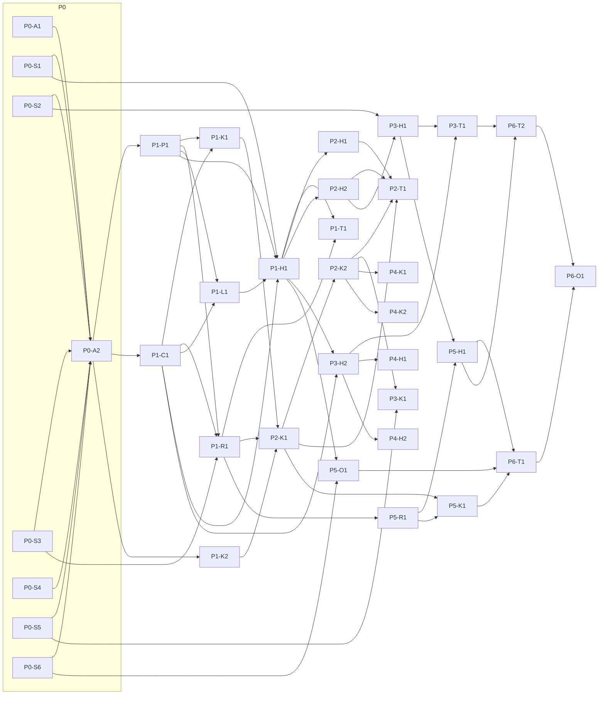

# Roadmap

Seven phases, each a GitHub milestone. Every task is a packet in [`docs/tasks/`](tasks/README.md) and a GitHub issue generated from it (`node scripts/sync-issues.mjs`). A phase is complete when all its packets are merged **and** its exit gate passes.

Roles: **INT** Integrator/Architect · **PC** Protocol & Crypto · **RLY** Relay · **HST** Host (dsh integration) · **AND** Android · **VER** Verification & Security ([AGENTS.md §3](../AGENTS.md#3-roles-and-ownership)).

## Phase overview

| Phase | Milestone | Exit gate |
|---|---|---|
| P0 | P0 · Specify & Spike | All ⟂ SPIKE assumptions answered in `docs/spikes/`; specs and ADRs updated; contracts marked **v1-frozen** |
| P1 | P1 · Foundations | TS and Kotlin protocol/crypto pass all vectors incl. cross-language handshake; relay core passes workers tests; host plugin loads in a real `remora-e2e` profile and answers `hello` from the testkit through a local relay |
| P2 | P2 · Pairing & Sessions | On a real phone: pair → list → open → prompt → live stream → cancel; e2e scenarios green in CI |
| P3 | P3 · Interaction & Safety | Approvals/questions answered from phone with PC GUI open and closed; high-risk requires biometric signature; security suite green |
| P4 | P4 · Remote Work | New session in an allowlisted root from the phone; files and diffs viewable; path-escape matrix green |
| P5 | P5 · Notifications & Always-on | Pushes for all kinds incl. host offline; host survives reboot/logon via `remora service`; keep-awake verified |
| P6 | P6 · Harden & Release | Reliability/perf/security matrices signed off; operations guide complete; signed APK; `v1.0.0` tag |

## Task list

| Id | Title | Role | Depends on |
|---|---|---|---|
| [P0-A1](tasks/P0-A1.md) | Conformance vector format, generator scaffolding, contract review | INT | — |
| [P0-S1](tasks/P0-S1.md) | Spike: dsh in-process adapter from an out-of-tree bundle | HST | — |
| [P0-S2](tasks/P0-S2.md) | Spike: approval/question race against the dsh web GUI | HST | — |
| [P0-S3](tasks/P0-S3.md) | Spike: Durable Object relay with hibernating WebSockets | RLY | — |
| [P0-S4](tasks/P0-S4.md) | Spike: Noise IKpsk2 in TypeScript and Kotlin with Cacophony vectors | PC | — |
| [P0-S5](tasks/P0-S5.md) | Spike: Keystore biometric-bound approval signatures verified in Node | AND | — |
| [P0-S6](tasks/P0-S6.md) | Spike: Windows always-on host without admin + keep-awake | HST | — |
| [P0-A2](tasks/P0-A2.md) | P0 exit: integrate spike findings, freeze contracts v1 | INT | P0-A1, P0-S1…S6 |
| [P1-P1](tasks/P1-P1.md) | `@remora/protocol`: RCP/1 + RLY/1 types, schemas, codecs | PC | P0-A2 |
| [P1-C1](tasks/P1-C1.md) | `@remora/crypto`: Noise, identities, relay auth, pairing, signatures, push AEAD | PC | P0-A2 |
| [P1-K1](tasks/P1-K1.md) | Kotlin `:core:protocol` + `:core:crypto` pass shared vectors | PC | P1-P1, P1-C1 |
| [P1-K2](tasks/P1-K2.md) | Android toolchain modernization + app shell | AND | P0-A2 |
| [P1-R1](tasks/P1-R1.md) | Relay core: enrollment, auth, routing, presence, limits | RLY | P0-S3, P1-P1, P1-C1 |
| [P1-L1](tasks/P1-L1.md) | `@remora/relay-link`: TypeScript relay client | RLY | P1-P1, P1-C1 |
| [P1-H1](tasks/P1-H1.md) | Host plugin foundation: bundle, config, identity, relay link, secure channel, RCP core | HST | P0-S1, P1-P1, P1-C1, P1-L1 |
| [P1-T1](tasks/P1-T1.md) | `@remora/testkit` + e2e harness | VER | P1-R1, P1-H1 |
| [P2-H1](tasks/P2-H1.md) | Pairing service, device registry, management page | HST | P1-H1 |
| [P2-K1](tasks/P2-K1.md) | Android pairing flow, key storage, relay transport, secure channel | AND | P1-K1, P1-K2, P1-R1 |
| [P2-H2](tasks/P2-H2.md) | Session adapter: RCP sessions.* over the dsh gateway | HST | P1-H1 |
| [P2-K2](tasks/P2-K2.md) | Android sessions list and conversation | AND | P2-K1 |
| [P2-T1](tasks/P2-T1.md) | Vertical slice e2e + device test runbook | VER | P2-H1, P2-H2, P2-K1, P2-K2 |
| [P3-H1](tasks/P3-H1.md) | AnswerBridge: approvals and questions | HST | P0-S2, P2-H2 |
| [P3-H2](tasks/P3-H2.md) | Policy Guard: roots, risk, signatures, limits | HST | P1-H1, P1-C1 |
| [P3-K1](tasks/P3-K1.md) | Android approvals, questions, biometric signing, app lock | AND | P2-K2, P0-S5 |
| [P3-T1](tasks/P3-T1.md) | Security test suite (threat model §5) | VER | P3-H1, P3-H2 |
| [P4-H1](tasks/P4-H1.md) | Workspaces, directory browse, remote session start | HST | P3-H2 |
| [P4-K1](tasks/P4-K1.md) | Android new-session flow and directory browser | AND | P2-K2 |
| [P4-H2](tasks/P4-H2.md) | Files and diffs (hardened git runner) | HST | P3-H2 |
| [P4-K2](tasks/P4-K2.md) | Android files, viewer, changes, diff viewer | AND | P2-K2 |
| [P5-R1](tasks/P5-R1.md) | Relay push dispatch + host-offline alarm | RLY | P1-R1 |
| [P5-H1](tasks/P5-H1.md) | Host Notifier | HST | P3-H1, P5-R1 |
| [P5-K1](tasks/P5-K1.md) | Android FCM, notifications, deep links | AND | P2-K1, P5-R1 |
| [P5-O1](tasks/P5-O1.md) | `remora` CLI: service, supervisor, doctor; plugin keep-awake | HST | P0-S6, P1-H1 |
| [P6-T1](tasks/P6-T1.md) | Reliability and performance matrix | VER | P5-H1, P5-K1, P5-O1 |
| [P6-T2](tasks/P6-T2.md) | Threat-model review, dependency audit, hardening | VER | P3-T1, P5-H1 |
| [P6-O1](tasks/P6-O1.md) | Release: operations guide, signed APK, compat matrix, v1.0.0 | INT | P6-T1, P6-T2 |

## Dependency graph

## Parallelism guide

- **P0:** all six spikes and P0-A1 run in parallel (6 agents). P0-A2 waits for all.
- **P1:** PC starts P1-P1 and P1-C1 together; AND runs P1-K2; RLY starts P1-L1 and P1-R1 as soon as protocol/crypto types exist (agree on exported type names first); HST starts P1-H1 on the P0-S1 scaffold and stubs crypto until P1-C1 lands.
- **P2–P5:** Host and Android tracks proceed in parallel against the frozen RCP spec; the Android track develops against `@remora/testkit` scenarios and recorded RCP transcripts before the host feature exists.
- Contract changes during any phase follow the [contract-change process](../AGENTS.md#6-contract-change-process) and block only the affected tasks.
